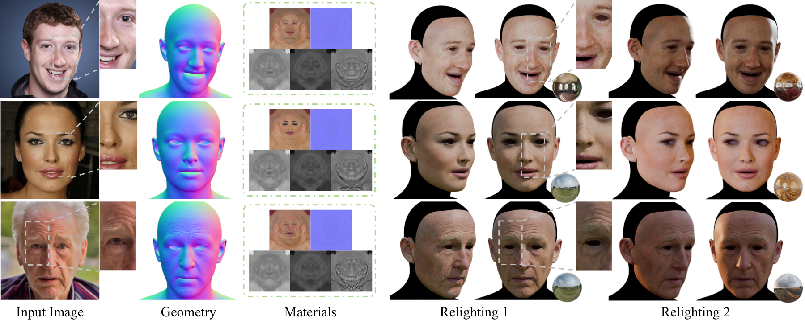

# MARCUS-Avatar

Official implementation of **"Monocular Avatar Reconstruction via Cascaded Diffusion Priors and UV-Space Differentiable Shading"** (ECCV 2026).

[[Project Page](https://luh1124.github.io/MARCUS-Avatar-Projectpage/)] · [[Paper](https://arxiv.org/abs/2606.28144)] · [[HF Weights](https://huggingface.co/luh0502/MARCUS-Avatar)]

## Overview

MARCUS reconstructs high-fidelity, relightable 3D face avatars from a single in-the-wild portrait image. The released inference code generates UV-space PBR assets and exportable 3D avatar files from either a single image or a folder of images.



## Installation

### Option 1: pip / conda

```bash
git clone https://github.com/luh1124/MARCUS-Avatar.git
cd MARCUS-Avatar

conda create -n marcus python=3.10
conda activate marcus

# Choose the PyTorch build that matches your CUDA runtime.
pip install torch torchvision torchaudio --index-url https://download.pytorch.org/whl/cu121

pip install -r requirements.txt
```

### Option 2: pixi

If you use [pixi](https://pixi.sh/):

```bash
pixi install
pixi run download-weights
pixi run app
```

## Download Weights

The repository does not store model weights or topology assets in git. Download them from Hugging Face:

```bash
python download_weights.py
```

This restores:

```text
ckpts/
assets/topo/
```

By default, the runtime loads these upstream models directly from Hugging Face:

```text
meituan-longcat/LongCat-Image-Edit
fancyfeast/llama-joycaption-beta-one-hf-llava
```

If you keep local copies or run in an offline environment, override the paths with environment variables.

## Runtime Paths

Optional environment variables:

```bash
export HF_REPO_ID="luh0502/MARCUS-Avatar"
export CKP_DIR="./ckpts"
export TOPO_DIR="./assets/topo"
export BASE_MODEL_PATH="meituan-longcat/LongCat-Image-Edit"
export JOY_CAPTION_MODEL="fancyfeast/llama-joycaption-beta-one-hf-llava"
export BLENDER_PATH="/path/to/blender"
```

## Usage

### Gradio Demo

```bash
python app.py
```

The demo opens a local Gradio interface for single-image avatar reconstruction.

### Batch Inference

```bash
python batch_infer.py ./examples -o ./outputs
```

The input can be either a single image or a folder. See all options with:

```bash
python batch_infer.py --help
```

Typical outputs include reconstructed meshes, UV textures, PBR material maps, and optional `.glb` / `.blend` files. `.blend` export requires Blender to be available through `BLENDER_PATH` or the `blender` command.

## Repository Structure

```
MARCUS-Avatar/
├── app.py                  # Gradio demo entry point
├── batch_infer.py          # Single-image / folder batch inference
├── download_weights.py     # Hugging Face weight downloader
├── runtime_paths.py        # Shared runtime path configuration
├── pipeline.py             # Pipeline utilities and programmatic inference helpers
├── longcat_image/          # Core model, preprocessing, reconstruction, texture, and render code
├── third_party/            # Vendored face detection / parsing helpers
├── utils/                  # Image I/O plus GLB / Blender export helpers
├── styles/                 # Gradio UI styling
├── examples/               # Example input images
├── requirements.txt        # pip dependencies for inference
└── pixi.toml               # optional pixi environment
```

Large runtime files are downloaded separately and ignored by git:

```text
ckpts/
assets/topo/
outputs/
```

Local maintenance, evaluation, and experimental helper scripts are intentionally excluded from the public inference release.

## License

This project is released under the MIT License.

## Citation

```bibtex
@inproceedings{li2026marcus,
  title={Monocular Avatar Reconstruction via Cascaded Diffusion Priors and UV-Space Differentiable Shading},
  author={Li, Hong and Meng, Minqi and Liang, Yanjun and Ye, Chongjie and Chen, Houyuan and Xiao, Weiqing and Guo, Xianda and Lei, Guojun and Liu, Xuhui and Yang, Chaojie and Peng, Yanlun and Zhao, Hao and Zhang, Baochang},
  booktitle={European Conference on Computer Vision (ECCV)},
  year={2026}
}
```
